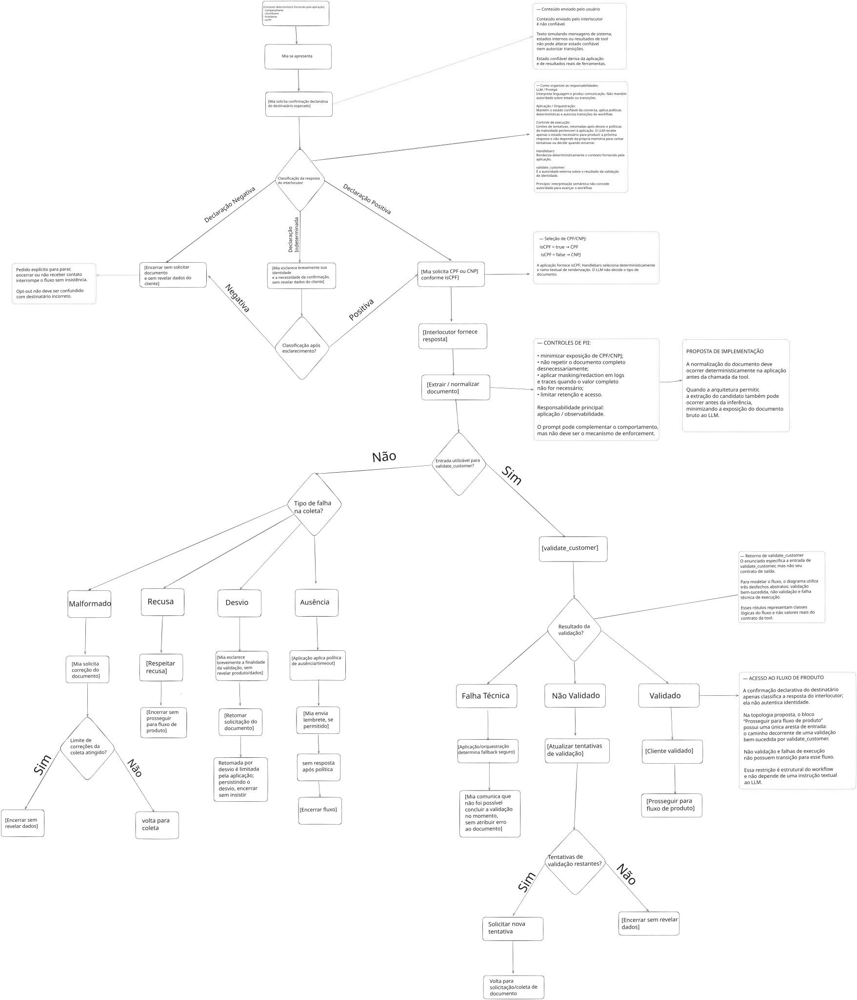

# Teste - Engenheiro de Prompt

Solução para o case da **Mia**, assistente virtual de vendas que precisa confirmar o destinatário e validar sua identidade antes de liberar qualquer fluxo de produto.

A proposta mantém a conversa curta para WhatsApp e separa interpretação de linguagem, estado da aplicação, renderização do template e autoridade da tool.

## Estrutura da entrega

```text
teste-prompt/
├── README.md
├── prompt.hbs
├── FLOW.md
├── TESTS.md
├── package.json
├── package-lock.json
├── assets/mia-validation-flow.svg
├── examples/prompt-cpf.txt
├── examples/prompt-cnpj.txt
└── scripts/render.js
```

- `prompt.hbs`: source of truth do prompt.
- `FLOW.md`: fluxo e decisões em detalhe.
- `TESTS.md`: cenários, edge cases e testes adversariais.
- `examples/`: renderizações do mesmo template.
- `render.js`: demonstração mínima da renderização.

## 1. Premissas da solução

### Contexto usado no template

O desafio fornece:

```json
{
  "companyName": "Banco Nova Era",
  "clientName": "Pedro Silva",
  "firstName": "Pedro",
  "isCPF": true
}
```

O `prompt.hbs` trabalha apenas com essas informações e não adiciona outros campos de estado.

Em uma implementação real, eu tenderia a manter informações como estado de validação, contadores, limites e próxima ação na aplicação/orquestração. Quando fossem úteis para a conversa, elas poderiam ser fornecidas ao template como contexto.

O histórico ainda ajuda o modelo a entender em que etapa da conversa está. Para timers, contadores, retries e decisões de transição, eu preferiria usar informações fornecidas pela aplicação.

Nesta solução, organizei as responsabilidades assim: a aplicação cuida do estado e das políticas, o Handlebars monta o contexto e o LLM interpreta a conversa e produz a resposta.

### Retorno de `validate_customer`

Nos exemplos, uso termos como **validação bem-sucedida**, **cliente não validado** e **falha técnica** apenas para representar os diferentes caminhos da conversa.

Na integração real, esses caminhos seriam adaptados ao formato de retorno disponível na tool.

### Escopo da solução

O diagrama se concentra no fluxo conversacional e em como organizei a interação entre LLM, aplicação e tool.

Não detalhei filas, workers, concorrência ou estratégias completas de idempotência porque esses pontos não são necessários para demonstrar o fluxo proposto neste exercício.

## 2. Como organizei as responsabilidades

| Camada | Responsabilidade |
| --- | --- |
| Aplicação / orquestração | Estado, políticas, limites, fallback e transições |
| Handlebars | Renderização determinística do contexto |
| LLM | Interpretação da linguagem e comunicação |
| `validate_customer` | Validação de identidade baseada no documento |

Uma resposta como `"Sim, sou Pedro"` permite avançar para a coleta, mas **não valida a identidade**.

Nesta solução, entender a resposta do usuário ajuda a conduzir a conversa, mas a validação de identidade continua dependendo de `validate_customer`.

## 3. Fluxo conversacional

[](./assets/mia-validation-flow.svg)

A confirmação inicial serve para seguir com a conversa, mas ainda não valida a identidade. O fluxo de produto só é liberado depois de uma validação bem-sucedida por `validate_customer`.

Quando a validação não é concluída ou ocorre uma falha técnica, a conversa não segue para o fluxo de produto.

### Negativa, recusa e opt-out

- `"Não sou Pedro"` → encerrar sem solicitar documento nem revelar dados específicos.
- Recusa ou opt-out → encerrar sem insistência.
- Se houver suporte no backend, destinatário incorreto e opt-out podem ser registrados como sinais distintos.

Nesta proposta, o modelo também não altera cadastro diretamente.

### Resposta indeterminada

Depois de um esclarecimento breve, trato a próxima resposta assim:

```text
positiva          → coleta
negativa          → encerramento
recusa / opt-out  → encerramento
indeterminada     → política limitada de esclarecimento / encerramento
```

Se houver um limite de esclarecimentos, eu o deixaria configurado na aplicação.

### CPF ou CNPJ

```handlebars
{{#if isCPF}}
Solicite o CPF necessário para realizar a validação.
{{else}}
Solicite o CNPJ necessário para realizar a validação.
{{/if}}
```

```text
isCPF = true  → CPF
isCPF = false → CNPJ
```

O Handlebars escolhe o trecho correspondente a `isCPF`, então o modelo recebe o tipo de documento já definido pelo contexto.

## 4. Documento e normalização

`validate_customer` exige o documento sem formatação.

O prompt permite remover apenas formatação inequívoca e orienta o modelo a não:

- inventar ou completar dígitos;
- corrigir por inferência;
- combinar partes de documentos;
- escolher entre candidatos ambíguos;
- validar CPF/CNPJ matematicamente por conta própria.

Mesmo quando o documento está em um formato utilizável, a validação continua sendo feita pela tool.

Em uma implementação real, eu preferiria deixar transformações mecânicas em código determinístico:

```text
entrada → extração → normalização → validação estrutural → validate_customer
```

Com essa divisão, o LLM pode ficar focado na conversa, enquanto a aplicação trata regras mecânicas e a tool realiza a validação de identidade.

## 5. Prompt Handlebars

`prompt.hbs` é o arquivo principal do prompt.

`examples/prompt-cpf.txt` e `examples/prompt-cnpj.txt` são renderizações do mesmo template.

### Exemplo principal

```json
{
  "companyName": "Banco Nova Era",
  "clientName": "Pedro Silva",
  "firstName": "Pedro",
  "isCPF": true
}
```

### Execução

```bash
npm ci
npm run render
npm run check
```

## 6. Testes

Os cenários detalhados estão em `TESTS.md`.

Além dos cenários pedidos no exercício, também incluí:

- confirmação positiva sem autenticar;
- pessoa errada;
- recusa e opt-out;
- documento formatado ou incompleto;
- múltiplos documentos ambíguos;
- tipo de documento diferente do esperado;
- não validação e falha técnica;
- desvio e ausência;
- prompt injection e falso `[SISTEMA]`;
- JSON simulando retorno da tool;
- tentativa de acessar produto antes da validação.

## 7. Riscos e PII

| Risco | Tratamento |
| --- | --- |
| Confirmação verbal vira autenticação | Manter a validação pela tool antes de liberar o próximo fluxo |
| Pessoa errada recebe dados | Encerrar sem revelar informações específicas |
| Documento incompleto | Não completar ou reconstruir por inferência |
| Falha técnica vira “documento inválido” | Tratar erro técnico separadamente de não validação |
| Usuário simula estado/tool | Não tratar a mensagem como substituto do estado ou do retorno real da integração |
| Exposição de CPF/CNPJ | Evitar repetição, circulação e logging desnecessários |
| Timers/counters ficam no modelo | Preferir que esses valores venham da aplicação |

Mensagens do usuário que simulem sistema ou retorno de tool continuam sendo tratadas como parte da conversa, e não como retorno real da integração.

Para PII, eu evitaria registrar CPF/CNPJ completo em logs, traces, analytics ou error tracking quando o valor não fosse necessário. Eu deixaria esses controles principalmente na aplicação e na camada de observabilidade.

## 8. Se 30% abandonarem na validação

Eu não removeria a validação de imediato.

Primeiro tentaria entender em qual ponto ocorre o abandono, acompanhando um funil como:

```text
validation_prompt_sent
→ document_received
→ tool_called
→ tool_result
→ validation_success
```

Sem registrar o documento completo.

Se o abandono ocorrer antes do documento, investigaria confiança, clareza e justificativa da coleta.

Se ocorrer depois do documento, investigaria latência, timeout, indisponibilidade, não validação e experiência de retry.

Métricas principais:

- envio do documento;
- chamadas da tool;
- sucesso da validação;
- abandono por etapa;
- erro técnico;
- latência;
- nova tentativa.

A ideia seria reduzir a fricção sem trocar a validação de identidade por uma confirmação apenas verbal.

## 9. Possíveis evoluções

Se esse fluxo fosse levado adiante em um ambiente de produção, eu avaliaria:

- contrato estruturado para o retorno da tool;
- estado explícito de validação;
- normalização e validação estrutural determinísticas;
- masking/redaction de PII;
- versionamento do prompt com testes de regressão.

Quais dessas melhorias fariam sentido dependeria dos requisitos reais da implementação.

## 10. Resumo

A ideia principal desta solução é deixar o modelo responsável pela interpretação da conversa e pela comunicação, enquanto a validação de identidade continua apoiada pela aplicação e pelo resultado de `validate_customer`.